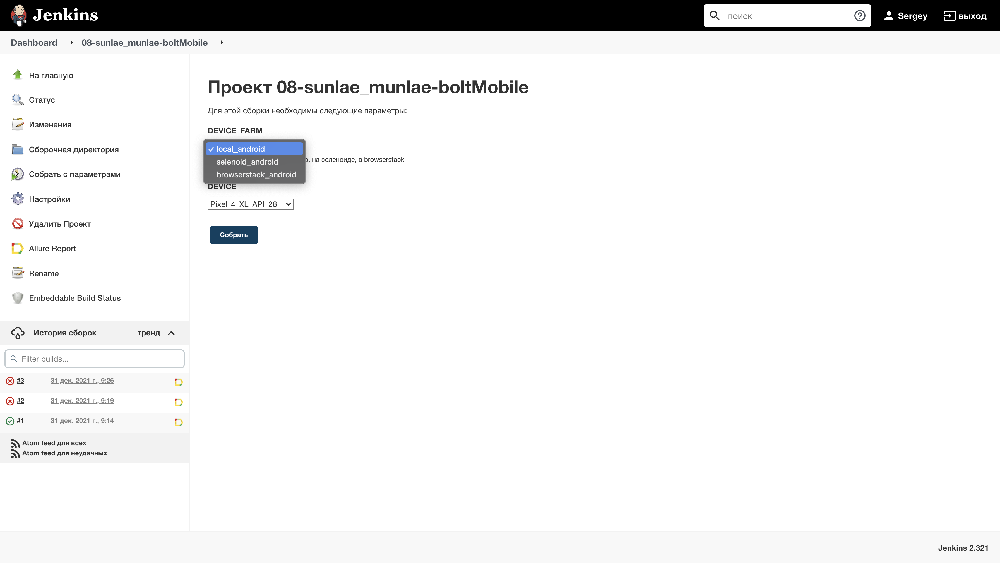
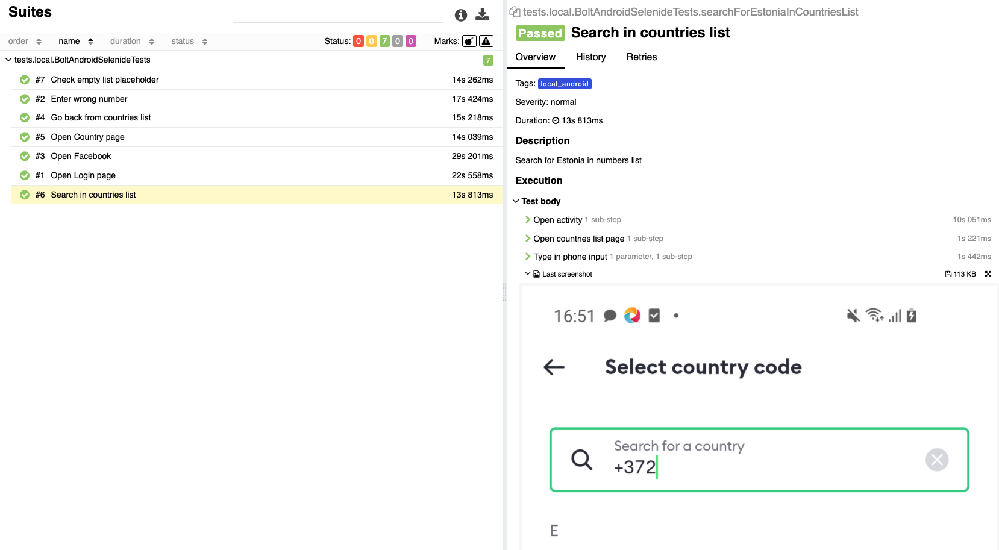

<code></code>

# Bolt mobile automation project
### UI tests for bolt app https://play.google.com/store/apps/details?id=ee.mtakso.client

## Technology Stack:

<code></code>
<code></code>
<code></code>
<code></code>
<code></code>
<code></code>
<code></code>
<code></code>

## Description

Project contains Appium tests on first two screens Android application.
The following screens are covered 

1. Login page
2. Select country page

## Tests

This suite doesn't pretend to be exaustive

1. Open login page
2. Open countries list
3. Enter wrong phone number
4. Go back from countries list
5. Search country in countries list
6. Check empty list placeholder
7. Open Facebook

## Job settings

Test could be launched from Jenkins with 3 device farm options: 

* local
* selenoid
* browserstack

## Allure report

Each test has screenshot and page source attached

